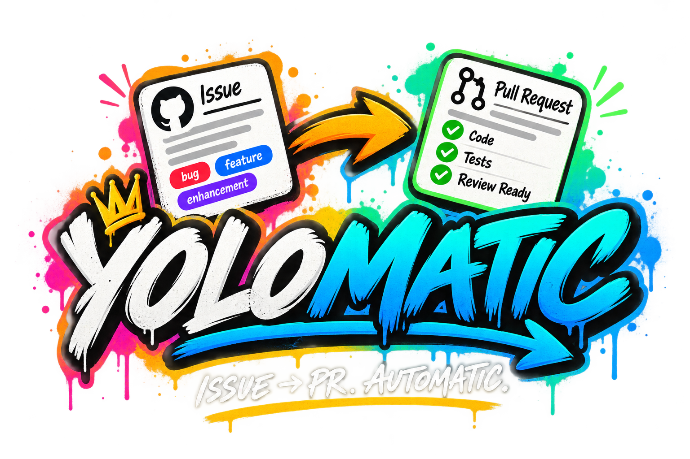
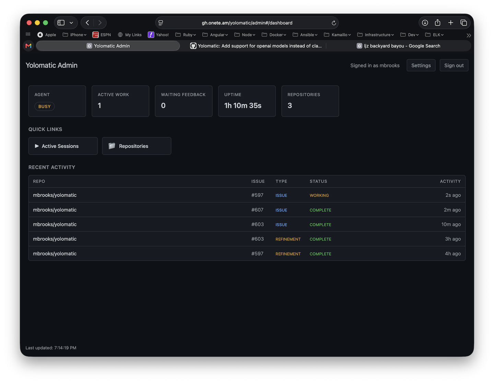
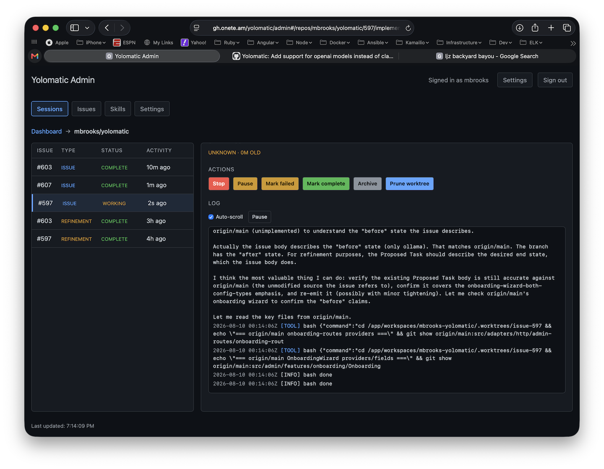
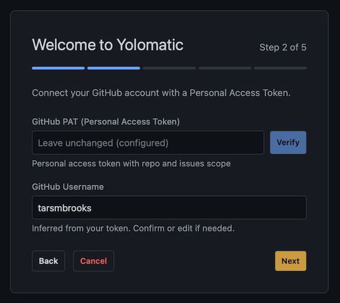

<div align="center">
  <picture>
    
  </picture>

  <h1>Yolomatic</h1>
  <p><strong>Task Automation &amp; Response System</strong></p>
</div>

Yolomatic is a self-hosted coding agent that turns GitHub issues into pull requests using isolated execution and protected credentials.

Assign an issue to Yolomatic, and it creates an isolated Git worktree, launches a disposable coding-agent worker, and carries the task from design and implementation through feedback and pull request delivery.

## Overview

Yolomatic provides a self-hosted control plane for delegating GitHub issues to coding agents. The admin app brings setup, repository management, session controls, and live execution logs into one place, while GitHub remains the source of truth for issues, feedback, and pull requests.

### Dashboard

See agent availability, active work, repository counts, and recent issue and refinement activity at a glance.

<p align="center">
  
</p>

### Active sessions

Follow an agent's work as it happens, inspect its live log, and pause, stop, complete, archive, or clean up a session from the repository workspace.

<p align="center">
  
</p>

### Guided onboarding

The setup wizard walks administrators through account creation, GitHub authentication, model configuration, and repository initialization.

<p align="center">
  
</p>

## Why use Yolomatic?

Yolomatic is a good fit when you want to delegate coding tasks without introducing a complex orchestration platform. It also lets you run coding agents in "yolo mode" (dangerously skip permissions) safely on a dedicated server, without needing to run them on your desktop.

Yolomatic is intentionally not a full-blown orchestration platform. Instead, it uses GitHub issues as a lightweight, flexible work queue.

Yolomatic works best with focused, issue-sized tasks. For larger projects, use Claude Code or Codex to break the work into smaller issues, then let Yolomatic implement each one.

## Features

- **Issue refinement** — project collaborators can run `/yolomatic issue-refinement` to launch a disposable worker that investigates a new issue and replaces its body with a more complete Proposed Task, without starting implementation.
- **Issue-to-PR automation** — creates a `yolomatic/issue-{number}` branch, commits the result, pushes it, and opens a linked pull request.
- **GitHub-native collaboration** — responds to issue updates, comments, PR reviews, and inline review comments.
- **Multi-repository support** — manages each repository, worktree, and issue session independently.
- **Admin dashboard** — configure repositories and models, start and control sessions, manage skills, and inspect live logs.
- **Webhook or polling events** — use a public webhook endpoint, GitHub polling, or both.
- **Persistent sessions** — stores settings, session state, and logs in SQLite and resumes interrupted work after restarts.
- **Isolated workers** — runs each agent execution in a disposable Docker container without GitHub credentials or access to the Docker socket.

## Install

### Requirements

- Docker Engine or Docker Desktop with Docker Compose (not currently compatible with Kubernetes but PRs welcome!)
- A GitHub personal access token that can read and modify the repositories Yolomatic will manage

### Start Yolomatic

```bash
git clone https://github.com/mbrooks/yolomatic.git
cd yolomatic
cp .env.example .env
docker compose up --build -d
```

Open [http://127.0.0.1:6767/yolomatic/admin](http://127.0.0.1:6767/yolomatic/admin) and complete the setup wizard. It will:

1. Create the master admin account (full name, username, and password). Additional admin users can be added later from the dashboard.
2. Verify your GitHub token.
3. Generate a webhook secret.
4. Configure the AI / LLM provider (Ollama or OpenAI), the provider-specific sign-in / API key, and the LLM model. OpenAI uses an `OPENAI_API_KEY` forwarded to worker containers.
5. Select repositories and initialize their workspaces.

Follow the logs with:

```bash
docker compose logs -f yolomatic
```

Stop Yolomatic with:

```bash
docker compose down
```

Yolomatic persists its settings, sessions, workspaces, agent configuration, and runtime data in Docker volumes.

To rerun the onboarding wizard without deleting existing settings, open
**Settings**, click **Rerun On-Boarding** button, and confirm
the action.

To force the wizard to run from the command line instead:

```bash
docker compose exec -T yolomatic npm run onboarding:reset
```

Refresh `/yolomatic/admin` after the command completes. Restart Yolomatic as well if you
want it to start in onboarding-only mode:

```bash
docker compose restart yolomatic
```

To dump every effective configuration value using the same
database-over-environment-over-default precedence as Yolomatic:

```bash
docker compose exec -T yolomatic npm run config:dump
```

The output includes all values, including tokens, passwords, and webhook
secrets. Treat it as secret material.

## Connect GitHub

Yolomatic can receive repository activity by webhook, polling, or both. Choose the global mode under **Settings → GitHub Integration**, or override it for an individual repository.

### Webhook

Expose port `6767` through HTTPS, then create a GitHub repository webhook with:

- **Payload URL:** `https://your-host.example/webhook`
- **Content type:** `application/json`
- **Secret:** the secret generated during setup
- **Events:** issues, issue comments, pull request reviews, pull request review comments, and push (for automatic PR rebasing when the default branch advances)

For local testing, a tunnel such as `ngrok http 6767` can provide the public URL.

### Polling

Select `polling` if Yolomatic cannot receive a public webhook. No public URL is required. The default polling interval is 60 seconds.

## Usage

1. Add a repository in the setup wizard or the **Repositories** screen.
2. Open an issue with a clear description and acceptance criteria.
3. Assign the issue to the GitHub account connected to Yolomatic, or choose **Start Session** from the issue in the admin dashboard.
4. Follow progress in GitHub or inspect the live session log in the dashboard.
5. Add an issue comment that tags the configured Yolomatic account (or contains the `/yolomatic feedback` command) to steer active work, or update the issue description. Yolomatic keeps the same issue session and worktree. Prior non-trigger comments on the issue are gathered as background context for the next feedback pass.
6. Review the pull request. Actionable review comments trigger another implementation pass and are pushed to the same branch.

When a new commit lands on a managed repository's default branch, Yolomatic automatically checks its own open pull requests for that repository and rebases any that now conflict (running the same `git rebase origin/main` worker iteration used by `/yolomatic fix-merge-conflicts`), posting a comment on each affected PR when the rebase starts. PRs that are still mergeable are left alone. This works whether the commit is observed via a `push` webhook or detected by polling the default-branch HEAD.

Yolomatic uses workflow labels and GitHub comments to show its current state:

| Label | Meaning |
| --- | --- |
| `yolomatic-working` | The issue is being processed. |
| `yolomatic-feedback-required` | Yolomatic needs more information. |
| `yolomatic-pr-created` | The implementation has been pushed and a PR is ready. |
| `yolomatic-failed` | The agent run failed. |
| `yolomatic-cancelled` | The session was stopped. |

The configured admin GitHub user can stop an issue from GitHub by commenting:

```text
/yolomatic stop
```

## Issue Refinement

An authorized maintainer can ask Yolomatic to investigate a newly opened issue and replace its body with a more complete Proposed Task. When an eligible issue is opened, Yolomatic posts a static comment explaining the command. To start refinement, comment exactly:

```text
/yolomatic issue-refinement
```

Refinement launches the same disposable Docker worker used for implementation, but in a temporary worktree. The worker may inspect the repository, make experimental edits, run the application and tests, and use the network. When it succeeds, Yolomatic automatically replaces the issue body with the returned Proposed Task; the title, implementation session, and PR workflow remain untouched. The original body and refinement provenance are stored in the refinement history for audit and recovery.

Refinement behavior can be customized by adding `.pi/skills/issue-refinement/SKILL.md` to the target repository. If the skill is missing, Yolomatic falls back to built-in prompt defaults. A present skill that cannot be read or executed produces a failed refinement attempt rather than silently switching instructions.

Refinement and implementation cannot overlap on the same issue, and refinement never commits, pushes, or opens a pull request.

Sessions can also be paused, resumed, restarted, archived, or deleted from the admin dashboard when their current state permits it.

## How It Works

Yolomatic is the control plane: it receives GitHub events, manages repositories and session state, and performs GitHub delivery. Each agent run happens in a separate, disposable worker container that edits the shared issue worktree and streams its activity back to Yolomatic over a WebSocket session.

The diagram below shows the high-level request and event flow. The **Yolomatic control plane** owns everything deterministic — event intake, session and workspace state, delivery — while **worker execution** is isolated in a disposable container with no GitHub credentials and no Docker socket access.


Legend:

- **Solid arrows** are primary flows; **dotted arrows** are optional fallbacks (polling).
- The control plane handles event intake, session and worktree lifecycle, and GitHub delivery. It owns GitHub credentials and persistent state.
- The worker handles agent execution only — it edits the issue worktree, calls the configured LLM provider, and streams activity back over a single session-scoped WebSocket connection. It has no GitHub credentials and no Docker socket access.

See [design/README.md](design/README.md) for the worker architecture and protocol.

## Development

```bash
npm ci
npm run build
npm run guardrail:test
```

Useful commands:

```bash
npm run dev          # watch the server
npm run dev:admin    # run the admin UI with Vite
npm test             # run unit tests
```

Running agent sessions still requires Docker because Yolomatic executes coding work in worker containers.

## License

Yolomatic is licensed under the [GNU Affero General Public License v3.0 only](LICENSE).

## Operations

- [WORKSPACES.md](WORKSPACES.md) — repository checkout and worktree conventions
- [CRON.md](CRON.md) — automatic deployment updates
- [MIGRATIONS.md](MIGRATIONS.md) — SQLite migration management
- [CHANGELOG.md](CHANGELOG.md) — release changes

Yolomatic writes application and agent logs to standard output. In Docker, use `docker compose logs` rather than looking for log files.
