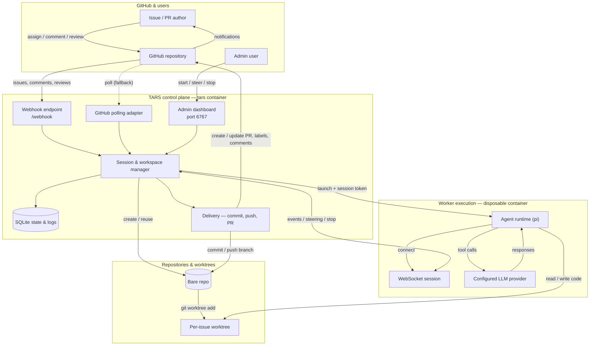

# TARS

TARS (Task Automation & Response System) is a self-hosted coding agent that turns GitHub issues into pull requests.

Assign an issue to TARS—or start it from the admin dashboard—and TARS creates an isolated worktree, launches a disposable coding-agent worker, and carries the task through implementation, feedback, and PR delivery.

## Features

- **Issue-to-PR automation** — creates a `tars/issue-{number}` branch, commits the result, pushes it, and opens a linked pull request.
- **GitHub-native collaboration** — responds to issue updates, comments, PR reviews, and inline review comments.
- **Multi-repository support** — manages each repository, worktree, and issue session independently.
- **Admin dashboard** — configure repositories and models, start and control sessions, manage skills, and inspect live logs.
- **Webhook or polling events** — use a public webhook endpoint, GitHub polling, or both.
- **Persistent sessions** — stores settings, session state, and logs in SQLite and resumes interrupted work after restarts.
- **Isolated workers** — runs each agent execution in a disposable Docker container without GitHub credentials or access to the Docker socket.

## Install

### Requirements

- Docker Engine or Docker Desktop with Docker Compose
- A GitHub personal access token that can read and modify the repositories TARS will manage

### Start TARS

```bash
git clone https://github.com/mbrooks/tars.git
cd tars
cp .env.example .env
docker compose up --build -d
```

Open [http://127.0.0.1:6767/tarsadmin](http://127.0.0.1:6767/tarsadmin) and complete the setup wizard. It will:

1. Create admin credentials.
2. Verify your GitHub token.
3. Generate a webhook secret.
4. Select repositories and initialize their workspaces.

Follow the logs with:

```bash
docker compose logs -f tars
```

Stop TARS with:

```bash
docker compose down
```

TARS persists its settings, sessions, workspaces, agent configuration, and runtime data in Docker volumes.

To rerun the onboarding wizard without deleting existing settings, open
**Settings → General**, click the red **Rerun On-Boarding** button, and confirm
the action.

To force the wizard to run from the command line instead:

```bash
docker compose exec -T tars npm run onboarding:reset
```

Refresh `/tarsadmin` after the command completes. Restart TARS as well if you
want it to start in onboarding-only mode:

```bash
docker compose restart tars
```

To dump every effective configuration value using the same
database-over-environment-over-default precedence as TARS:

```bash
docker compose exec -T tars npm run config:dump
```

The output includes all values, including tokens, passwords, and webhook
secrets. Treat it as secret material.

## Connect GitHub

TARS can receive repository activity by webhook, polling, or both. Choose the global mode under **Settings → GitHub Integration**, or override it for an individual repository.

### Webhook

Expose port `6767` through HTTPS, then create a GitHub repository webhook with:

- **Payload URL:** `https://your-host.example/webhook`
- **Content type:** `application/json`
- **Secret:** the secret generated during setup
- **Events:** issues, issue comments, pull request reviews, and pull request review comments

For local testing, a tunnel such as `ngrok http 6767` can provide the public URL.

### Polling

Select `polling` if TARS cannot receive a public webhook. No public URL is required. The default polling interval is 60 seconds.

## Usage

1. Add a repository in the setup wizard or the **Repositories** screen.
2. Open an issue with a clear description and acceptance criteria.
3. Assign the issue to the GitHub account connected to TARS, or choose **Start Session** from the issue in the admin dashboard.
4. Follow progress in GitHub or inspect the live session log in the dashboard.
5. Add an issue comment or update the issue description to steer active work. TARS keeps the same issue session and worktree.
6. Review the pull request. Actionable review comments trigger another implementation pass and are pushed to the same branch.

TARS uses workflow labels and GitHub comments to show its current state:

| Label | Meaning |
| --- | --- |
| `tars-working` | The issue is being processed. |
| `tars-feedback-required` | TARS needs more information. |
| `tars-pr-created` | The implementation has been pushed and a PR is ready. |
| `tars-failed` | The agent run failed. |
| `tars-cancelled` | The session was stopped. |

The configured admin GitHub user can stop an issue from GitHub by commenting:

```text
/tars stop
```

Sessions can also be paused, resumed, restarted, archived, or deleted from the admin dashboard when their current state permits it.

## How It Works

TARS is the control plane: it receives GitHub events, manages repositories and session state, and performs GitHub delivery. Each agent run happens in a separate, disposable worker container that edits the shared issue worktree and streams its activity back to TARS over a WebSocket session.

The diagram below shows the high-level request and event flow. The **TARS control plane** owns everything deterministic — event intake, session and workspace state, delivery — while **worker execution** is isolated in a disposable container with no GitHub credentials and no Docker socket access.



Legend:

- **Solid arrows** are primary flows; **dotted arrows** are optional fallbacks (polling).
- The control plane handles event intake, session and worktree lifecycle, and GitHub delivery. It owns GitHub credentials and persistent state.
- The worker handles agent execution only — it edits the issue worktree, calls the configured LLM provider, and streams activity back over a single session-scoped WebSocket connection. It has no GitHub credentials and no Docker socket access.

See [design/README.md](design/README.md) for the worker architecture and protocol.

## Development

```bash
npm ci
npm run build
npm run guardrail:test
```

Useful commands:

```bash
npm run dev          # watch the server
npm run dev:admin    # run the admin UI with Vite
npm test             # run unit tests
```

Running agent sessions still requires Docker because TARS executes coding work in worker containers.

## Operations

- [WORKSPACES.md](WORKSPACES.md) — repository checkout and worktree conventions
- [CRON.md](CRON.md) — automatic deployment updates
- [MIGRATIONS.md](MIGRATIONS.md) — SQLite migration management
- [CHANGELOG.md](CHANGELOG.md) — release changes

TARS writes application and agent logs to standard output. In Docker, use `docker compose logs` rather than looking for log files.
