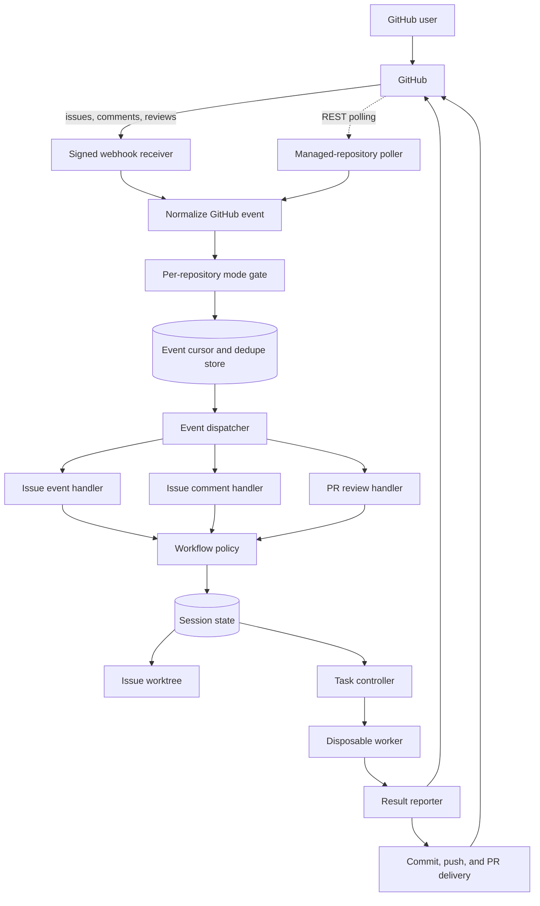

# GitHub Workflow

Status: as-built design

Last verified: 2026-08-01 against `github/main` at `26171605efdd`

## Purpose

This document describes the current GitHub-facing workflow implemented by
Yeetomatic: how repository activity enters the control plane, how an issue is
selected and executed, how feedback changes an active or completed session,
and how completed work is delivered as a pull request.

Proposed behavior is explicitly labeled and is not part of the as-built flow.

The worker transport and container protocol are documented separately in
[architecture.md](architecture.md) and the protocol documents in this folder.
This document focuses on orchestration and GitHub behavior.

## Core Invariants

- GitHub events from webhooks and polling are normalized into one event model
  before business logic runs.
- One durable session, one issue worktree, and one deterministic branch belong
  to each `owner/repo#issue` tuple.
- The issue branch is `yeetomatic/issue-{number}` and the worktree is
  `WORKSPACES_DIR/{owner}-{repo}/.worktrees/issue-{number}`.
- Only one execution may own a session key at a time. Duplicate work is either
  ignored or steered into the active execution.
- A pull request review can run code only when the PR maps back to the stored
  issue session and PR association.
- The control plane owns the GitHub token, authenticated Git operations,
  commits, pushes, comments, labels, and PR creation. The worker never receives
  GitHub credentials and must not publish its own work.
- Yeetomatic never merges its own pull requests or closes the source issue.

## System Flow



`pull_request` events also pass through normalization and deduplication, but
the dispatcher currently logs them and records them as polling subjects rather
than invoking an execution command.

## Configuration and Repository Scope

GitHub event behavior is controlled by global settings plus optional
repository overrides:

| Setting | Purpose | Default |
| --- | --- | --- |
| `github_event_mode` | Selects `webhook`, `polling`, or `both`. | `webhook` |
| `github_poll_interval_ms` | Base interval for active polling subjects. | `60000` |
| `default_branch` | Global PR base and workspace fallback. | `main` |
| Repository `githubEventMode` | Overrides the global event mode. | Inherit global |
| Repository `defaultBranch` | Overrides the global PR base. | Inherit global |

Managed repositories and their overrides are stored in the `repositories`
SQLite table. The runtime snapshots that table when it starts, so repository
mode and default-branch changes require a restart before the event graph uses
them.

An event is accepted only when its source is enabled for that repository. For
example, a webhook delivery for a polling-only repository is ignored even when
the global runtime has a webhook handler active.

## Event Ingestion

### Webhooks

`POST /webhook` is the public GitHub entry point.

1. The server reads the raw request body.
2. It verifies `X-Hub-Signature-256` with an HMAC-SHA256 digest and a
   timing-safe comparison.
3. It reads `X-GitHub-Event` and `X-GitHub-Delivery`.
4. It normalizes supported payloads into the internal `GitHubEvent` union.
5. It awaits dispatch and returns `200 OK` only after the handler finishes.
6. Invalid signatures return `401`; handler failures return `500` so GitHub can
   redeliver.

Supported normalized webhook event types are:

- `issues`
- `issue_comment`
- `pull_request`
- `pull_request_review`
- `pull_request_review_comment`

### Polling

Polling starts when the global mode or at least one managed repository mode
includes polling. It polls repositories returned by the managed-repository
store rather than every repository visible to the token.

On each tick, the poller:

1. Reads the persisted `last_event_received_at` cursor.
2. On the first tick, initializes the cursor to the current time and dispatches
   no historical events.
3. On later ticks, subtracts a two-minute overlap from the cursor.
4. Fetches updated issues, assignment timeline events, issue comments, pull
   requests, reviews, and inline review comments for each eligible repository.
5. Re-polls known issue and PR subjects on an adaptive schedule.
6. Sorts normalized events by GitHub occurrence time and dispatches them in
   order.

Subject polling uses the base interval for activity less than one day old,
15 minutes after one day of inactivity, and one hour after three days.
Overlapping ticks are suppressed by a process-local lock.

### Deduplication and Cursoring

The `GitHubEventStore` persists three kinds of state in SQLite:

- the global `last_event_received_at` cursor;
- processed event IDs in `github_event_dedupe`;
- known issue and PR subjects in `github_poll_subjects`.

Comments and reviews use GitHub object IDs in their normalized event IDs, so a
poll result and webhook for the same object converge on the same dedupe key.
An event is marked seen only after its command completes successfully. A
duplicate is ignored before any handler runs.

The cursor is advanced to the control plane's current time after each
successfully handled event. The two-minute polling overlap protects the gap
between GitHub occurrence time and local receipt time.

## Routing and Eligibility

| Event | Accepted actions | Main behavior |
| --- | --- | --- |
| `issues` | `opened`, `assigned` | Create or reuse a pending session and start execution. |
| `issues` | `edited` | Steer the new body to an active task, or update the idle session title and body. |
| `issues` | `unassigned` | Return a working or waiting session to `pending`, remove workflow labels, and comment. |
| `issue_comment` on an issue | `created` | Steer an active task or start a feedback iteration. |
| `issue_comment` on a PR | `created` | Route through the PR review workflow. |
| `pull_request_review` | `submitted`, `edited` | Classify and process review feedback. |
| `pull_request_review_comment` | `created`, `edited` | Classify and process inline feedback. |
| `pull_request` | Any normalized action | Log and maintain polling-subject state; no execution. |

Issue pickup is rejected when any of these conditions applies:

- the event was emitted by the configured Yeetomatic GitHub account;
- the issue has `wontfix` or `invalid`;
- an `opened` or `assigned` issue is not assigned to Yeetomatic;
- the same issue event is already in flight;
- the existing session is not `pending`;
- the control plane is draining for a deployment.

Ordinary issue comments are accepted only when they are newly created,
authored by a non-bot account other than Yeetomatic, and the issue is assigned
to Yeetomatic. Payloads identified as belonging to a closed issue are rejected.
The issue must be assigned to Yeetomatic and the comment must explicitly
trigger feedback by mentioning the configured account or `@yeetomatic`, or by
containing the `/yeetomatic feedback` comment command. The Yeetomatic-visible
label is no longer part of the comment gate (neither required nor sufficient).
A mention still adds the `yeetomatic` routing-marker label, but that label no
longer affects gate eligibility. When a qualifying trigger comment is accepted,
Yeetomatic gathers the issue's prior non-trigger, non-Yeetomatic-authored
comments and includes them as a "Prior discussion" context section in the
feedback/steering prompt sent to the session.

## Proposed: Pre-Implementation Issue Refinement

Yeetomatic should offer to expand a newly opened issue into a Proposed Task.
The `issues.opened` path posts static instructions only: it does not invoke a
model, prepare a worktree, create a session, or interpret the issue body.

Only the configured administrator can start refinement in the first
implementation, using an exact `/yeetomatic issue-refinement` comment. That
authenticated command is also approval to run the worker and apply the result.
The static instructions explain that refinement gives an LLM-driven worker
repository, shell, test, and network access. Because issue content can influence
the worker's behavior, they tell the maintainer to verify the issue before
starting refinement.

Refinement launches a fresh instance of the existing disposable Docker worker
against a temporary refinement worktree. The worker follows
`.pi/skills/issue-refinement/SKILL.md` when present; if that skill is absent, it
follows Yeetomatic's built-in issue-refinement defaults from the prompt. It may
inspect the application, make experimental changes, and run tests before
returning a Proposed Task. The control plane verifies that the source issue has
not changed and automatically replaces its body. The title is unchanged.

Refinement uses the same issue-level task admission key as implementation but
bypasses normal commit, push, and pull-request delivery. Its temporary changes
are discarded after the worker exits.

The complete interaction, authorization, persistence, failure, and
auto-assignment design is specified in
[issue-refinement.md](issue-refinement.md).

## Initial Issue Execution

An initial run can start from an accepted assignment/open event or from the
admin dashboard. The dashboard path first assigns the issue to the configured
Yeetomatic GitHub account, then enters the same session and execution flow.

### Session and Worktree Preparation

1. `ensureSessionExists` looks up the durable session by
   `owner/repo#issueNumber`.
2. If no session exists, the workspace manager creates or refreshes the bare
   repository under `WORKSPACES_DIR/{owner}-{repo}`.
3. It creates the `yeetomatic/issue-{number}` worktree. An empty repository is
   initialized through the GitHub API with a `README.md`, then retried.
4. It creates a `pending` session containing issue context, labels, worktree
   path, and transcript path.
5. The issue is marked `yeetomatic-working` and receives the pickup comment.

### Admission and Preflight

`ExecuteSession` atomically registers the session key with `TaskController`.
The registration returns an ownership token. Only that owner can unregister
the task; a late completion from an older run cannot remove a newer task.

If registration loses a race, no second worker starts. Feedback attached to
the duplicate request is steered to the active execution when possible.

Before launching the worker, the control plane:

1. Re-confirms the issue worktree exists.
2. Rejects a session whose worktree path does not end in the expected issue
   directory.
3. When a PR is associated, verifies the PR head and stored session mapping.
4. Fetches remote branches, temporarily stashes dirty changes, and
   fast-forwards from `origin/yeetomatic/issue-{number}` when that branch
   exists.
5. If the local and remote PR branches diverged, asks GitHub to update the PR
   branch and retries the fast-forward. A divergent branch without a stored PR
   fails closed.
6. Restores the stash and rewrites `remote.origin.url` to a credential-free
   HTTPS URL.

Any preflight failure marks the session failed, adds `yeetomatic-failed`, and
posts a protective stop comment instead of launching a worker against an
ambiguous or credential-bearing workspace.

### Worker Execution

The disposable worker receives the issue prompt, worktree path, configured
model selection, and a session-scoped WebSocket URL. It edits the worktree and
streams activity and a terminal result back to the control plane. It has no
GitHub token and no Docker socket. Docker image, mount, networking, naming,
recovery, and cleanup behavior is described in
[protocol-launch.md](protocol-launch.md).

An active issue comment or issue-description edit is sent through the live
worker's steering channel instead of creating a new execution. Steering waits
up to five seconds for the live session handshake.

## Result State Machine

The worker result controls both durable session state and GitHub presentation:

| Result | Session state | GitHub behavior |
| --- | --- | --- |
| `working` | `working` | Keep or restore `yeetomatic-working`; post progress summary. |
| `waiting-feedback` | `waiting-feedback` | Add `yeetomatic-feedback-required`; post the clarification request. |
| `cancelled` | `cancelled` | Add `yeetomatic-cancelled`; post cancellation. |
| `failed` | `failed` | Add `yeetomatic-failed`; post failure details. |
| `complete` with changes | `complete` | Commit and push, create or reuse a PR, add `yeetomatic-pr-created`, and post the PR link. |
| `complete` without changes | `complete` | Post the summary and state that no code changes were necessary. |

Before normal issue transitions, Yeetomatic removes
`yeetomatic-working`, `yeetomatic-feedback-required`,
`yeetomatic-pr-created`, and `yeetomatic-complete`. The `yeetomatic` label is a
routing marker and is not removed by workflow transitions.

### Delivery

For a completed issue execution, the control plane:

1. Runs `git add -A` in the issue worktree.
2. Creates a commit when staged changes exist, using an issue-aware generated
   commit message.
3. Pushes `yeetomatic/issue-{number}` when the new commit or an already-local
   commit is ahead of the base.
4. Creates a PR titled `Yeetomatic: {issue title}` against the effective
   default branch.
5. Builds a PR body containing `Fixes #{issue}`, the worker summary, bounded
   issue context, and a bounded diff when one is available.
6. Persists the PR number and URL in the session.

If GitHub reports that a PR already exists, Yeetomatic finds the open PR with
the same head and base and associates it with the session. `No commits
between` is treated as a no-change completion.

Delivery failures are distinct from worker failures. Yeetomatic preserves the
worktree, captures Git status/diff diagnostics, marks the session failed, and
adds both `yeetomatic-working` and `yeetomatic-delivery-failed` so the work is
not mistaken for an agent failure. When self-reporting is enabled it also files
a bug against the configured Yeetomatic repository.

## Feedback and PR Iterations

### Issue Feedback

For an idle, eligible issue comment, Yeetomatic reuses the existing session and
worktree and launches another issue execution with the comment as feedback. A
paused session does not restart; it receives a paused-status comment. If no
session exists, the comment path may create one before starting.

Editing an issue behaves differently: it steers an active worker, but when the
session is idle it only updates the stored title and body. It does not start a
new run by itself.

### Pull Request Feedback

PR timeline comments, submitted reviews, and inline review comments converge
on `HandlePRReview`.

Before execution, Yeetomatic requires all of the following:

- the event is not from the Yeetomatic account;
- the PR is open and unmerged;
- the branch is either `yeetomatic/issue-{number}` with a session explicitly
  associated to this PR, or the PR number maps to a stored session;
- the stored session, issue number, PR number, and branch pass the mapping
  invariant.

Review bodies and inline comments are classified with a keyword heuristic.
Clearly conversational feedback such as `LGTM`, thanks, or a question is
acknowledged without code changes. Action words such as `fix`, `change`,
`update`, `please`, or `should` trigger an implementation pass. Unknown text
defaults to actionable.

For an actionable review:

1. Yeetomatic atomically registers the issue session and posts the iteration
   number.
2. The worker receives the review body, inline comments, file paths, and line
   numbers.
3. The iteration count is incremented after execution.
4. On completion, the control plane stages and commits any remaining changes,
   or recognizes commits already made by the worker, and pushes the same PR
   branch; it never creates a second PR.
5. Waiting, failure, cancellation, and progress results are reported on the PR
   timeline rather than the source issue.

If another execution already owns the session, review text is steered into it
when possible and the PR receives an explicit busy/steered response.

## Stop, Unassignment, Draining, and Restart

### GitHub Stop Command

The exact case-insensitive, whitespace-trimmed command is:

```text
/yeetomatic stop
```

Only `admin_github_username` may use it. The command works on both issue and
Yeetomatic-owned PR timelines. An active task receives an abort signal; a
working session without an active task is marked cancelled; an idle session
receives a no-op response.

### Unassignment

When an `issues.unassigned` payload shows that Yeetomatic is no longer among
the assignees, a `working` or `waiting-feedback` session returns to `pending`,
workflow labels are removed, and the issue receives a pause comment.

This handler does not itself abort a worker that is already registered. The
GitHub stop command or admin cancellation is the explicit cancellation path.

### Deployment Draining

While the task controller is draining:

- a new issue run is stored as `pending` with `resumeOnBoot`;
- issue feedback is appended to `queuedComments`;
- actionable PR feedback is appended to the same queue;
- GitHub receives a deployment-in-progress comment.

On startup, Yeetomatic resumes sessions with `resumeOnBoot` or `working`
status. Queued comments are combined into the resumed prompt and cleared after
the attempt. Very old working sessions may instead be marked failed by startup
stale detection.

## Security and Trust Boundaries

- Webhook authenticity is checked before JSON dispatch.
- The GitHub personal access token remains in the control plane.
- Authenticated Git commands receive credentials through temporary Git config
  headers. Token environment variables are removed from the Git subprocess
  environment.
- Repository remotes are stored as credential-free HTTPS URLs before the
  worker starts.
- Git hooks are disabled for authenticated control-plane Git commands.
- The worker can modify the shared workspace and use the network, but it
  cannot call GitHub as Yeetomatic, access the Docker socket, or read control
  plane state directly.

See [architecture.md](architecture.md#trust-boundaries) for the complete worker
trust model.

## Failure and Retry Semantics

- A webhook command failure returns HTTP 500. Because the event is marked seen
  only after success, a GitHub redelivery can retry it.
- Polling logs per-repository and per-event failures and continues processing
  the remaining work.
- Worker exceptions and explicit failed results mark the session failed and
  post diagnostics to the issue or PR.
- An exhausted model rate limit receives a specialized failure message.
- A cancellation aborts the live worker and transitions the session to
  `cancelled`.
- Delivery errors preserve local changes for recovery and use the separate
  `yeetomatic-delivery-failed` label.
- Empty or corrupt cached bare repositories are recloned. Certain stale-ref
  refresh failures also trigger a clean reclone.
- Dirty worktrees are stashed and restored around issue-run synchronization;
  stash conflicts fail closed and preserve the stash for manual recovery.

## Current Limitations

- Webhook dispatch is synchronous: the HTTP response waits for the entire
  command, including worker execution and delivery. A long run can therefore
  cause GitHub retries, which rely on deduplication and task admission.
- The first polling tick establishes a current-time baseline and intentionally
  does not backfill older activity.
- Polling requests use a maximum of 100 items per endpoint without pagination,
  and several adapter reads treat GitHub API errors as empty results. The
  overlap and subject polling reduce gaps but do not provide a strict
  at-least-once guarantee.
- Deduplication and GitHub side effects are not one transaction. If a handler
  mutates GitHub and then fails before `markSeen`, a retry may repeat an
  idempotent or visible side effect.
- `issues.unassigned` changes session state but does not abort an already
  running worker.
- PR review execution reuses the stored worktree directly and does not run the
  issue execution's `syncWorktree` preflight first.
- Review classification is keyword-based and intentionally defaults ambiguous
  feedback to actionable.
- Workflow cleanup does not remove `yeetomatic-failed`,
  `yeetomatic-cancelled`, or `yeetomatic-delivery-failed`; those labels can
  remain until another path or a human removes them.
- `pull_request` events are observed for polling state but do not directly
  change a session.
- Per-repository event-mode and default-branch overrides are restart-bound.
- Yeetomatic does not resolve merge conflicts, merge PRs, or close issues.

## Implementation Map

| Responsibility | Source |
| --- | --- |
| Runtime graph and mode selection | `src/app/bootstrap.ts` |
| Signed webhook HTTP endpoint | `src/webhook/server.ts`, `src/webhook/http-utils.ts` |
| Webhook normalization | `src/adapters/github/webhook-adapter.ts` |
| Polling and event normalization | `src/github-events/polling.ts`, `src/adapters/github/github-polling-adapter.ts` |
| Deduplication and polling state | `src/github-events/store.ts` |
| Unified dispatch and subject tracking | `src/github-events/dispatcher.ts` |
| Repository mode gate and command wiring | `src/webhook/handlers.ts` |
| Workflow eligibility policy | `src/domain/workflow/policy.ts` |
| Shared workflow transitions | `src/app/commands/workflow-helpers.ts` |
| Issue assignment/edit/unassignment | `src/app/commands/handle-issue-event.ts` |
| Issue and PR timeline comments | `src/app/commands/handle-issue-comment.ts` |
| PR review iterations | `src/app/commands/handle-pr-review.ts` |
| Manual dashboard start | `src/app/commands/start-issue-session.ts` |
| Execution admission and preflight | `src/app/commands/execute-session.ts`, `src/task-controller.ts` |
| Git worktrees and authenticated Git | `src/workspace/worktree.ts`, `src/workspace/git-runner.ts` |
| Result-to-GitHub reporting | `src/app/commands/execute-session-reporter.ts` |
| Initial commit, push, and PR creation | `src/app/commands/execute-session-delivery.ts` |
| GitHub mutations | `src/adapters/github/github-service-adapter.ts` |
| Durable session state | `src/session/manager.ts`, `src/session/store.ts` |
