# Issue Refinement Workflow

Status: proposed design

Last updated: 2026-08-01

## Purpose

Yeetomatic should let an authorized maintainer replace a newly opened issue's
body with a more complete Proposed Task. Refinement begins only after an exact,
authenticated `/yeetomatic issue-refinement` command.

Opening an issue does not start refinement. Yeetomatic posts a static comment
explaining the command and worker capabilities, warning maintainers to verify
the issue because its content can influence worker behavior.

The authenticated command is both the request to run refinement and approval
to replace the issue body with the result; there is no intermediate proposal or
separate apply command.

Refinement reuses the existing Docker worker image, launch path, WebSocket
protocol, logging, tool runtime, and cleanup behavior. Each attempt runs in a
fresh disposable container and a temporary refinement worktree. A second
Docker image or long-lived refinement service is not required.

## Trust Model

Issue refinement uses a trust-based security model. Yeetomatic authorizes the
GitHub user who sends the exact command and then allows the worker to treat the
issue and repository as task input.

The refinement worker has the same broad capabilities as a normal issue
worker: it can inspect repository files, use a shell, make temporary edits, run
the application and tests, and use the network. This lets it validate theories
before writing the Proposed Task. It also means a maintainer should invoke the
command only when they trust the issue content and repository context to be
processed by the configured model and worker tools.

The normal worker boundary still applies: GitHub credentials and deterministic
GitHub mutations remain in the Yeetomatic control plane. The worker returns a
result; it does not update the issue, commit, push, or create a pull request.

## Goals

- Explain the issue-refinement workflow on every eligible new issue without
  starting a worker automatically.
- Require an authorized exact command before refinement runs.
- Give the refinement worker enough repository and tool access to investigate
  the request and test its conclusions.
- Use `.pi/skills/issue-refinement/SKILL.md` from the target repository when it
  exists.
- Fall back to Yeetomatic's built-in issue-refinement prompt defaults when the
  repository skill is absent.
- Automatically replace the issue body with the returned Proposed Task.
- Preserve the original body and refinement provenance for audit and recovery.
- Prevent refinement and implementation workers from racing on the same issue.
- Discard all experimental source changes after refinement completes.

## Non-Goals

- Automatically refining an issue when it is opened.
- Accepting refinement requests from arbitrary issue participants.
- Displaying a draft and waiting for a second approval command.
- Creating a second issue from the Proposed Task.
- Committing, pushing, or opening a pull request from refinement work.
- Starting implementation because the issue body was refined.
- Creating a separate refinement worker image or service.

## User Experience

### 1. Post static instructions

When an eligible issue is opened, Yeetomatic posts exactly one static comment:

```markdown
## Yeetomatic issue refinement

An authorized maintainer can ask Yeetomatic to investigate this issue and
replace its body with a more complete Proposed Task. Yeetomatic uses this
repository's `issue-refinement` skill when available, otherwise it uses its
built-in issue-refinement defaults.

To start, comment:

`/yeetomatic issue-refinement`

The command starts an LLM-driven worker with repository, shell, test, and
network access. Because issue content can influence the worker's behavior,
verify the issue before starting refinement.

When refinement succeeds, Yeetomatic automatically replaces this issue body.
The original body is retained in Yeetomatic's refinement history. Refinement
does not start implementation or create a pull request.
```

The comment is defined in control-plane code. Creating it does not prepare a
worktree, launch a worker, or create an implementation session.

Yeetomatic does not post the instructions when:

- the repository is not managed by this Yeetomatic instance;
- the issue is closed or is a pull request;
- the issue was opened by the configured Yeetomatic account or another bot;
- issue refinement is disabled for the repository; or
- an instruction comment has already been recorded for the issue.

### 2. Run the authenticated command

An authorized maintainer comments:

```text
/yeetomatic issue-refinement
```

The command must be the entire trimmed comment body. Matching is
case-insensitive, but aliases, suffixes, arguments, Markdown wrappers, and
commands embedded in quoted text are rejected.

After accepting the command, Yeetomatic:

1. re-fetches the issue and verifies that it is still open;
2. records the current title, body, and body fingerprint;
3. atomically claims the issue's task-admission key;
4. prepares a temporary refinement worktree from the effective default branch;
5. selects the repository's `issue-refinement` skill when present, otherwise
   selecting Yeetomatic's built-in prompt defaults;
6. launches a fresh instance of the existing Docker worker for refinement;
7. lets the worker investigate, make experimental edits, and run relevant tests;
8. receives a Proposed Task and a concise record of the investigation;
9. re-fetches the issue and verifies that its body has not changed;
10. replaces the issue body through the GitHub API;
11. posts a short completion comment identifying the requesting maintainer; and
12. destroys the refinement container and temporary worktree without delivery.

If the issue changes while refinement is running, Yeetomatic leaves the newer
body unchanged and asks the maintainer to run the command again.

### 3. Update the issue body

The issue title remains unchanged. The Proposed Task becomes the issue body,
typically using sections such as:

```markdown
## Summary

...

## Requirements

- ...

## Acceptance criteria

- ...

## Out of scope

- ...
```

After the update, Yeetomatic posts:

```markdown
Issue refined at the request of @maintainer. The issue body now contains the
Proposed Task. No implementation session was started.
```

## End-to-End Flow

```mermaid
sequenceDiagram
    actor User as GitHub user
    participant GH as GitHub
    participant CP as Yeetomatic control plane
    participant Worker as Disposable refinement worker

    User->>GH: Open issue
    GH->>CP: issues.opened
    CP->>GH: Post static instructions and verification warning
    Note over CP,Worker: No worker starts on issue creation
    User->>GH: Comment /yeetomatic issue-refinement
    GH->>CP: issue_comment.created
    CP->>CP: Authenticate, authorize, refetch, and claim issue
    CP->>CP: Create temporary refinement worktree
    CP->>Worker: Launch existing worker with refinement task
    Worker->>Worker: Inspect, experiment, and test
    Worker-->>CP: Return Proposed Task and investigation summary
    CP->>CP: Verify result and source fingerprint
    CP->>GH: Replace original issue body
    CP->>GH: Post completion comment
    CP->>CP: Remove temporary worktree
```



## Authentication and Authorization

The GitHub webhook signature authenticates that GitHub delivered the event; it
does not by itself authorize the sender to refine an issue.

For the first implementation, only the exact configured
`admin_github_username` may run `/yeetomatic issue-refinement`. Authorization
uses the signed webhook's `sender.login`.

Repository collaborators may be supported later through a deterministic GitHub
permission lookup requiring `write`, `maintain`, or `admin`. The issue author
role alone is not sufficient authorization.

Every request must also satisfy these checks:

- the webhook action is `created`;
- the comment is on an open issue, not a pull request;
- the sender is a human and is not the configured Yeetomatic account;
- the command is an exact match;
- the repository is managed and refinement is enabled;
- no implementation or refinement task is active; and
- the issue does not already have a completed implementation session.

## Skill Selection

The worker looks for the target repository's skill at:

```text
.pi/skills/issue-refinement/SKILL.md
```

The skill is read from the temporary refinement worktree prepared from the
effective default branch. When it exists, the worker follows it. When it is
missing, the worker follows Yeetomatic's built-in issue-refinement defaults
provided in the refinement prompt. A present skill that cannot be read or
executed produces a failed refinement attempt instead of silently switching
instructions.

The refinement record stores the repository commit and identifies whether the
attempt used the repository skill or built-in defaults.

## Worker Execution and Workspace

Refinement uses the existing disposable worker workflow with a distinct
`issue-refinement` execution kind. It reuses:

- the worker Docker image and build cache;
- `docker run --rm` launch and cleanup behavior;
- the session-specific WebSocket reservation and handshake;
- event, log, heartbeat, steering, stop, and completion handling; and
- the existing agent and tool runtime.

The host creates a temporary refinement worktree rather than using the normal
`yeetomatic/issue-{number}` implementation worktree. The worker may modify this
worktree and run the application or tests to investigate the issue. Those
changes are evidence for refinement only and are discarded after the attempt.

Refinement must not enter the normal delivery path. It does not commit changes,
push a branch, create a pull request, or persist experimental edits into a later
implementation session. Normal implementation starts from its ordinary issue
worktree and uses the refined issue body as its task description.

## Result Contract

The worker returns a refinement-specific result containing:

- `proposedTaskBody`: the complete Markdown body to apply to the issue;
- `summary`: a concise explanation of what was clarified;
- `investigation`: relevant files, commands, tests, and observations; and
- the normal execution status and failure information.

The control plane verifies that a successful result contains a non-empty body
within GitHub's supported size limits. Repository owner, issue number,
requester identity, and authorization remain properties of the accepted
command; the worker result does not select the GitHub target.

## Refinement State and Idempotency

Refinement state is durable and separate from the normal implementation
session. Each command creates an immutable attempt with these conceptual states:

| State | Meaning |
| --- | --- |
| `instructed` | Yeetomatic posted the static workflow instructions. |
| `running` | An authorized command owns the issue task key. |
| `applied` | The Proposed Task replaced the issue body. |
| `stale` | The issue changed during refinement, so no update occurred. |
| `failed` | Preparation, worker execution, validation, or GitHub mutation failed. |

The durable record includes:

- repository owner, repository name, and issue number;
- instruction and command comment IDs;
- requester identity;
- original title and body;
- original body fingerprint;
- returned Proposed Task body and investigation summary;
- instruction source (`repository-skill` or `prompt-defaults`);
- repository commit used for refinement;
- state, failure reason, and timestamps; and
- the GitHub delivery ID used for deduplication.

Repeated delivery of one command event cannot launch another run or update the
issue twice. A later authenticated command may refine the body again and
creates a new attempt linked to the prior one.

Yeetomatic-authored `issues.edited` events caused by applying the result are
ignored by normal issue-edit steering and cannot start implementation.

## Interaction With Normal Issue Execution

Refinement is a pre-implementation workflow:

- an unassigned issue remains unassigned after refinement;
- automatic body replacement does not assign the issue to Yeetomatic;
- normal implementation starts later through assignment or the admin dashboard;
- refinement and implementation share the issue-level task-admission key and
  cannot overlap;
- an issue with an active or completed implementation session cannot be
  refined; and
- implementation reads the refined body when its session is created.

Repositories that automatically assign new issues to Yeetomatic need a
repository-level admission policy if maintainers must have time to request
refinement before implementation. Without that policy, normal assignment-based
pickup retains its existing behavior and may make the issue ineligible before
the refinement command is sent.

## Failure Behavior

- Missing repository skill: use Yeetomatic's built-in issue-refinement defaults
  and record that source in the attempt.
- Present but unreadable or invalid skill: fail the attempt and report the
  configuration problem.
- Unauthorized command: do not start a worker or create a worktree.
- Worker unavailable or failed: retain the original issue body and post a
  concise retryable result.
- Worker requests clarification: retain the original body and post the question
  for the maintainer.
- Missing or oversized Proposed Task: reject the result and leave the issue
  unchanged.
- Source issue changed: mark the attempt stale and request a new command.
- GitHub update failed: retain both bodies in durable state and report the
  failure without retrying blindly.
- Duplicate command delivery: return the recorded outcome without repeating the
  worker run or mutation.
- Cleanup failure: report the leftover container or worktree for operator
  recovery without treating the issue update as an implementation delivery.

## Required Changes

The implementation is expected to add or extend these boundaries:

- deterministic `issues.opened` instruction-comment handling;
- exact `/yeetomatic issue-refinement` command parsing before ordinary feedback;
- administrator authorization from signed webhook identity;
- repository `issue-refinement` skill selection with a missing-skill fallback
  to built-in prompt defaults;
- durable refinement attempts and migrations;
- a refinement orchestration command separate from normal `ExecuteSession`;
- a refinement-specific execution method and structured result;
- an `issue-refinement` worker prompt kind;
- temporary refinement worktree creation and cleanup;
- issue-level atomic task admission shared with implementation;
- `GitHubService.updateIssueBody` for the automatic mutation; and
- tests for authorization, worker execution, idempotency, stale-source
  rejection, cleanup, and normal-workflow interaction.

## Acceptance Criteria

- A new eligible issue receives exactly one static instruction comment that
  includes the worker access and issue-verification warning.
- Opening an issue does not launch a refinement worker.
- Only `admin_github_username` can start refinement in the first implementation.
- The exact `/yeetomatic issue-refinement` command starts a fresh instance of
  the existing Docker worker workflow.
- The worker follows the target repository's `issue-refinement` skill when it
  exists.
- A missing repository skill uses Yeetomatic's built-in issue-refinement prompt
  defaults.
- The worker can inspect the repository, make temporary edits, run the
  application and tests, and investigate its conclusions before responding.
- A successful result automatically replaces only the original issue body; the
  title remains unchanged.
- The original body and refinement history remain durable.
- An issue edit made during refinement prevents automatic replacement.
- Replayed webhook deliveries cannot run refinement or mutate the issue twice.
- Refinement cannot overlap normal implementation.
- Experimental changes are discarded, and refinement cannot commit, push, or
  open a pull request.
- Normal implementation later reads the refined issue body.
